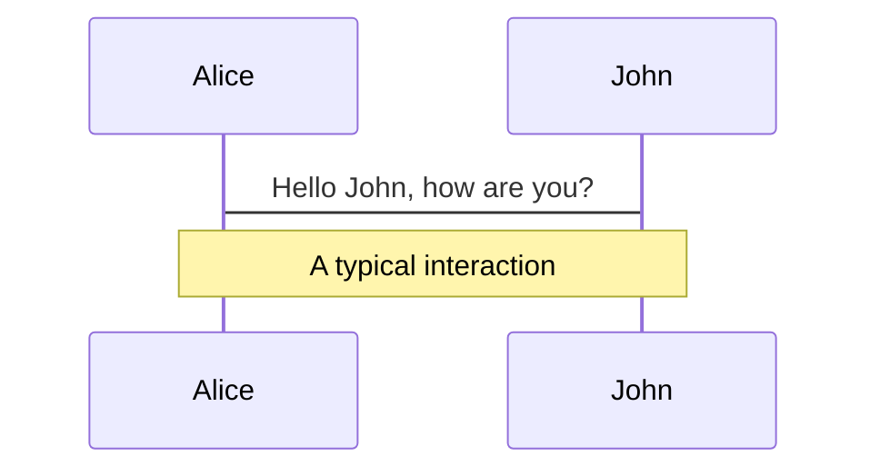
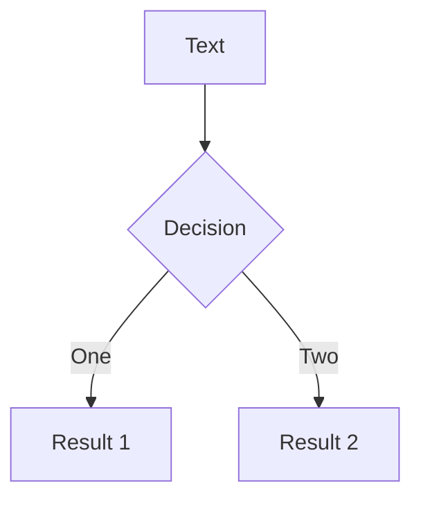
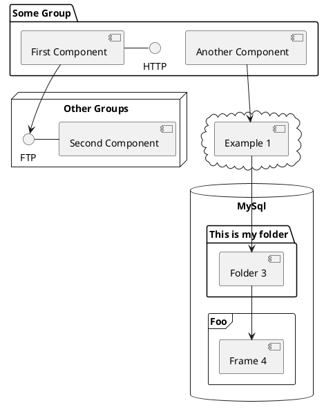

<div class="absolute top-10 right-10 opacity-90">
  
</div>

<div class="max-w-2xl mx-auto backdrop-blur-md bg-gray-900/30 px-8 py-10 shadow-xl shadow-purple-950">
  <div class="font-sans font-extrabold tracking-tighter leading-none font-extrabold bg-clip-text text-transparent bg-gradient-to-r from-emerald-200 via-indigo-300 to-purple-300">

# Mi primer bloque de Gutenberg con ACF
### Herald Flores & Luis López
  </div>
</div>

<div class="absolute bottom-0 left-0 w-full px-10 pb-6 flex gap-2 items-center opacity-70">
  
  <h2 class="font-extrabold bg-clip-text text-transparent bg-gradient-to-r from-emerald-200 via-indigo-300 to-purple-300">WordCamp Managua 2023</h2>
</div>

<!--
The last comment block of each slide will be treated as slide notes. It will be visible and editable in Presenter Mode along with the slide. [Read more in the docs](https://sli.dev/guide/syntax.html#notes)
-->

---

# Sobre nosotros

<div class="max-w-full mx-auto grid gap-6 mb-6 lg:mb-16 grid-cols-2 pt-10">
  <v-clicks>
    <div class="card items-center bg-gray-50 rounded-xl flex dark:bg-slate-900 dark:border-gray-700">
      
      <div class="p-5">
        <h3 class="text-xl font-bold tracking-tight text-gray-900 dark:text-white">
          <a href="https://github.com/luisperalta182" class="hover:text-gray-300 dark:hover:text-gray-500">Luis López</a>
        </h3>
        <span class="text-gray-500 dark:text-gray-400">
          Software Engineer
        </span>
        <p class="mt-2 mb-4 font-light text-gray-500 dark:text-gray-400">
          Entusiasta del desarrollado Frontend y WordPress, actualmente Software Engineer en Nicasource.
        </p>
        <ul class="flex space-x-4 sm:mt-0 list-none">
          <li class="list-none">
            <a href="https://github.com/luisperalta182" class="text-gray-500 hover:text-gray-900 dark:hover:text-white">
              <mdi-github />
            </a>
          </li>
          <li  class="list-none">
            <a href="https://www.linkedin.com/in/luisperalta182/" class="text-gray-500 hover:text-gray-900 dark:hover:text-white">
              <mdi-linkedin />
            </a>
          </li>
          <li class="list-none">
            <a href="https://profiles.wordpress.org/luisperalta182/" class="text-gray-500 hover:text-gray-900 dark:hover:text-white">
              <mdi-wordpress />
            </a>
          </li>
          <li class="list-none">
            <a href="https://www.instagram.com/luisperalta182/" class="text-gray-500 hover:text-gray-900 dark:hover:text-white">
              <mdi-instagram />
            </a>
          </li>
        </ul>
      </div>
    </div>
    <div class="card items-center bg-gray-50 rounded-xl flex dark:bg-slate-900 dark:border-gray-700">
      
      <div class="p-5">
        <h3 class="text-lg font-bold tracking-tight text-gray-900 dark:text-white">
            <a href="https://github.com/Herald-Flores" class="hover:text-gray-300 dark:hover:text-gray-500">Herald Flores</a>
        </h3>
        <span class="text-gray-500 dark:text-gray-400">
          Web Developer & Recruiter
        </span>
        <p class="mt-2 mb-4 font-light text-gray-500 dark:text-gray-400">
          Entusiasta del desarrollo, apasionado por el aprendizaje continuo y dedicado principalmente al desarrollo web.
        </p>
        <ul class="flex space-x-4 sm:mt-0 list-none">
          <li class="list-none">
            <a href="https://github.com/Herald-Flores" class="text-gray-500 hover:text-gray-900 dark:hover:text-white">
              <mdi-github />
            </a>
          </li>
          <li  class="list-none">
            <a href="https://www.linkedin.com/in/herald-flores/" class="text-gray-500 hover:text-gray-900 dark:hover:text-white">
              <mdi-linkedin />
            </a>
          </li>
          <li class="list-none">
            <a href="https://profiles.wordpress.org/heraldflores/" class="text-gray-500 hover:text-gray-900 dark:hover:text-white">
              <mdi-wordpress />
            </a>
          </li>
          <li class="list-none">
            <a href="https://www.instagram.com/heraldfloresdev/" class="text-gray-500 hover:text-gray-900 dark:hover:text-white">
              <mdi-instagram />
            </a>
          </li>
        </ul>
      </div>
    </div>
  </v-clicks> 
</div>

<div class="absolute top-10 right-10 opacity-90">
  
</div>
<div class="absolute bottom-0 left-0 w-full px-10 pt-4 pb-6 flex gap-2 items-center opacity-90 bg-black/40">
  
  <h2 class="font-extrabold bg-clip-text text-transparent bg-gradient-to-r from-emerald-200 via-indigo-300 to-purple-300">
    WordCamp Managua 2023
  </h2>
</div>

<!--
You can have `style` tag in markdown to override the style for the current page.
Learn more: https://sli.dev/guide/syntax#embedded-styles
-->

<style>
h1 {
 @apply font-extrabold bg-clip-text text-transparent bg-gradient-to-r from-emerald-200 via-indigo-300 to-purple-300;
}

.card{
  box-shadow: 5px 5px rgb(231 228 129 / 40%), 10px 10px rgb(227 229 127 / 31%), 15px 15px rgb(239 241 79 / 35%), 20px 20px rgb(187 168 67 / 10%), 25px 25px rgb(113 129 31 / 22%); box-shadow: 5px 5px rgba(0, 98, 90, 0.4), 10px 10px rgba(0, 98, 90, 0.3), 15px 15px rgba(0, 98, 90, 0.2), 20px 20px rgba(0, 98, 90, 0.1), 25px 25px rgba(0, 98, 90, 0.05);
}
</style>

---

# Qué es Gutenberg


<div class="grid max-w-screen-2xl px-4 py-8 mx-auto lg:gap-8 lg:py-10 lg:grid-cols-12">
<div class="mr-auto place-self-center lg:col-span-5">
<v-clicks>

- **Editor de Bloques**
- **Bloques Reutilizables**
- **Mayor Flexibilidad**
- **Interfaz de Arrastrar y Soltar**
- **Bloques Predeterminados**
</v-clicks>
</div>
<div class="hidden lg:mt-0 lg:col-span-7 lg:flex min-h-full">
  
</div>                
</div>

<div class="absolute top-10 right-10 opacity-90">
  
</div>
<div class="absolute bottom-0 left-0 w-full px-10 pt-4 pb-6 flex gap-2 items-center opacity-90 bg-black/40">
  
  <h2 class="font-extrabold bg-clip-text text-transparent bg-gradient-to-r from-emerald-200 via-indigo-300 to-purple-300">
    WordCamp Managua 2023
  </h2>
</div>

<!--
The last comment block of each slide will be treated as slide notes.
-->
<style>
h1 {
 @apply font-extrabold bg-clip-text text-transparent bg-gradient-to-r from-emerald-200 via-indigo-300 to-purple-300;
}
.img-shadow{
  box-shadow: 7px 7px 0px 0px #8b5cf6;
}
</style>
---

# Qué es Advanced Custom Fields *(ACF)*


<div class="grid max-w-screen-2xl px-4 py-8 mx-auto lg:gap-8 lg:py-10 lg:grid-cols-12">
<div class="mr-auto place-self-center lg:col-span-5">
<v-clicks>

- ACF es un popular plugin de WordPress para la creación de campos personalizados.
- Permite ampliar las funcionalidades de WordPress, incluyendo: custom fields, bloques, theme options, post types y taxonomías.

</v-clicks>
</div>
<div class="hidden lg:mt-0 lg:col-span-7 lg:flex min-h-full">
  
</div>                
</div>

<div class="absolute top-10 right-10 opacity-90">
  
</div>
<div class="absolute bottom-0 left-0 w-full px-10 pt-4 pb-6 flex gap-2 items-center opacity-90 bg-black/40">
  
  <h2 class="font-extrabold bg-clip-text text-transparent bg-gradient-to-r from-emerald-200 via-indigo-300 to-purple-300">
    WordCamp Managua 2023
  </h2>
</div>

<!--
The last comment block of each slide will be treated as slide notes.
-->
<style>
h1 {
 @apply font-extrabold bg-clip-text text-transparent bg-gradient-to-r from-emerald-200 via-indigo-300 to-purple-300;
}
.img-shadow{
  box-shadow: 7px 7px 0px 0px #8b5cf6;
}
</style>
---

# Introducción a los Bloques *(ACF)*


<div class="grid max-w-screen-2xl px-4 py-8 mx-auto lg:gap-8 lg:py-10 lg:grid-cols-12">
<div class="mr-auto place-self-center lg:col-span-6">
<v-clicks>

- Los Bloques ACF te permiten crear secciones personalizados en WordPress.
- Son secciones reutilizables.
- Tenemos una vista previa en tiempo real de cada bloque en el panel de administración.
- Brinda felicidad tanto a sus clientes como a nosotros.


</v-clicks>
</div>
<div class="hidden lg:mt-0 lg:col-span-6 lg:flex min-h-full">
  
</div>                
</div>

<div class="absolute top-10 right-10 opacity-90">
  
</div>
<div class="absolute bottom-0 left-0 w-full px-10 pt-4 pb-6 flex gap-2 items-center opacity-90 bg-black/40">
  
  <h2 class="font-extrabold bg-clip-text text-transparent bg-gradient-to-r from-emerald-200 via-indigo-300 to-purple-300">
    WordCamp Managua 2023
  </h2>
</div>

<!--
The last comment block of each slide will be treated as slide notes.
-->
<style>
h1 {
 @apply font-extrabold bg-clip-text text-transparent bg-gradient-to-r from-emerald-200 via-indigo-300 to-purple-300;
}
.img-shadow{
  box-shadow: 7px 7px 0px 0px #8b5cf6;
}
</style>
---

# Configuración del Entorno de Desarrollo


<div class="grid max-w-screen-2xl px-4 py-8 mx-auto lg:gap-8 lg:py-10 lg:grid-cols-12">
<div class="mr-auto place-self-center lg:col-span-6">
<v-clicks>

- Requisitos previos:
  - WordPress instalado y en funcionamiento.
  - Plugin ACF Pro instalado y activado.
  - Un editor de código (por ejemplo, Visual Studio Code).

- Decide si deseas incluir los Bloques ACF en tu tema o como un plugin independiente.

</v-clicks>
</div>
<div class="lg:col-span-6">

  <div  v-click="3">
  /theme-name <br>
	├── functions.php <br>
	└── /blocks <br>
		<span class="ml-8"></span>└── /hero <br>
				<span class="ml-16"></span>├── block.json <br>
				<span class="ml-16"></span>└── index.php <br>
  </div>
  <div v-click="4">
     /plugin-name <br>
      ├── index.php <br>
      └── /blocks <br>
        <span class="ml-8"></span>└── /hero <br>
          <span class="ml-16"></span>├── block.json <br>
          <span class="ml-16"></span>└── index.php <br>
  </div>
</div>                
</div>

<div class="absolute top-10 right-10 opacity-90">
  
</div>
<div class="absolute bottom-0 left-0 w-full px-10 pt-4 pb-6 flex gap-2 items-center opacity-90">
  
  <h2 class="font-extrabold bg-clip-text text-transparent bg-gradient-to-r from-emerald-200 via-indigo-300 to-purple-300">
    WordCamp Managua 2023
  </h2>
</div>

<!--
The last comment block of each slide will be treated as slide notes.
-->
<style>
h1 {
 @apply font-extrabold bg-clip-text text-transparent bg-gradient-to-r from-emerald-200 via-indigo-300 to-purple-300;
}
.img-shadow{
  box-shadow: 7px 7px 0px 0px #8b5cf6;
}
</style>
---


# Creemos un bloque con ACF


<div class="absolute top-10 right-10 opacity-90">
  
</div>
<div class="absolute bottom-0 left-0 w-full px-10 pt-4 pb-6 flex gap-2 items-center opacity-90">
  
  <h2 class="font-extrabold bg-clip-text text-transparent bg-gradient-to-r from-emerald-200 via-indigo-300 to-purple-300">
    WordCamp Managua 2023
  </h2>
</div>

<!--
The last comment block of each slide will be treated as slide notes.
-->
<style>
h1 {
 @apply font-extrabold bg-clip-text text-transparent bg-gradient-to-r from-emerald-200 via-indigo-300 to-purple-300;
}
.img-shadow{
  box-shadow: 7px 7px 0px 0px #8b5cf6;
}
</style>


<p v-after class="absolute bottom-23 left-45 opacity-30 transform -rotate-10">Here!</p>

---

layout: image-right
image: /background.jpg

---

# Code

Use code snippets and get the highlighting directly![^1]

```ts {all|2|1-6|9|all}
interface User {
  id: number
  firstName: string
  lastName: string
  role: string
}

function updateUser(id: number, update: User) {
  const user = getUser(id)
  const newUser = { ...user, ...update }
  saveUser(id, newUser)
}
```

<arrow v-click="3" x1="400" y1="420" x2="230" y2="330" color="#564" width="3" arrowSize="1" />

[^1]: [Learn More](https://sli.dev/guide/syntax.html#line-highlighting)

<style>
.footnotes-sep {
  @apply mt-20 opacity-10;
}
.footnotes {
  @apply text-sm opacity-75;
}
.footnote-backref {
  display: none;
}
</style>

---

# Components

<div grid="~ cols-2 gap-4">
<div>

You can use Vue components directly inside your slides.

We have provided a few built-in components like `<Tweet/>` and `<Youtube/>` that you can use directly. And adding your custom components is also super easy.

```html
<Counter :count="10" />
```

<!-- ./components/Counter.vue -->
<Counter :count="10" m="t-4" />

Check out [the guides](https://sli.dev/builtin/components.html) for more.

</div>
<div>

```html
<Tweet id="1390115482657726468" />
```

<Tweet id="1390115482657726468" scale="0.65" />

</div>
</div>

---

## class: px-20

# Themes

Slidev comes with powerful theming support. Themes can provide styles, layouts, components, or even configurations for tools. Switching between themes by just **one edit** in your frontmatter:

<div grid="~ cols-2 gap-2" m="-t-2">

```yaml
---
theme: default
---
```

```yaml
---
theme: seriph
---
```


</div>

Read more about [How to use a theme](https://sli.dev/themes/use.html) and
check out the [Awesome Themes Gallery](https://sli.dev/themes/gallery.html).

---

## preload: false

# Animations

Animations are powered by [@vueuse/motion](https://motion.vueuse.org/).

```html
<div
  v-motion
  :initial="{ x: -80 }"
  :enter="{ x: 0 }">
  Slidev
</div>
```

<div class="w-60 relative mt-6">
  <div class="relative w-40 h-40">
    
    
    
  </div>

  <div
    class="text-5xl absolute top-14 left-40 text-[#2B90B6] -z-1"
    v-motion
    :initial="{ x: -80, opacity: 0}"
    :enter="{ x: 0, opacity: 1, transition: { delay: 2000, duration: 1000 } }">
    Slidev
  </div>
</div>

<!-- vue script setup scripts can be directly used in markdown, and will only affects current page -->
<script setup lang="ts">
const final = {
  x: 0,
  y: 0,
  rotate: 0,
  scale: 1,
  transition: {
    type: 'spring',
    damping: 10,
    stiffness: 20,
    mass: 2
  }
}
</script>

<div
  v-motion
  :initial="{ x:35, y: 40, opacity: 0}"
  :enter="{ y: 0, opacity: 1, transition: { delay: 3500 } }">

[Learn More](https://sli.dev/guide/animations.html#motion)

</div>

---

# LaTeX

LaTeX is supported out-of-box powered by [KaTeX](https://katex.org/).

<br>

Inline $\sqrt{3x-1}+(1+x)^2$

Block

$$
\begin{array}{c}

\nabla \times \vec{\mathbf{B}} -\, \frac1c\, \frac{\partial\vec{\mathbf{E}}}{\partial t} &
= \frac{4\pi}{c}\vec{\mathbf{j}}    \nabla \cdot \vec{\mathbf{E}} & = 4 \pi \rho \\

\nabla \times \vec{\mathbf{E}}\, +\, \frac1c\, \frac{\partial\vec{\mathbf{B}}}{\partial t} & = \vec{\mathbf{0}} \\

\nabla \cdot \vec{\mathbf{B}} & = 0

\end{array}
$$

<br>

[Learn more](https://sli.dev/guide/syntax#latex)

---

# Diagrams

You can create diagrams / graphs from textual descriptions, directly in your Markdown.

<div class="grid grid-cols-3 gap-10 pt-4 -mb-6">







</div>

[Learn More](https://sli.dev/guide/syntax.html#diagrams)

---

layout: center
class: text-center

---

# Learn More

[Documentations](https://sli.dev) · [GitHub](https://github.com/slidevjs/slidev) · [Showcases](https://sli.dev/showcases.html)


